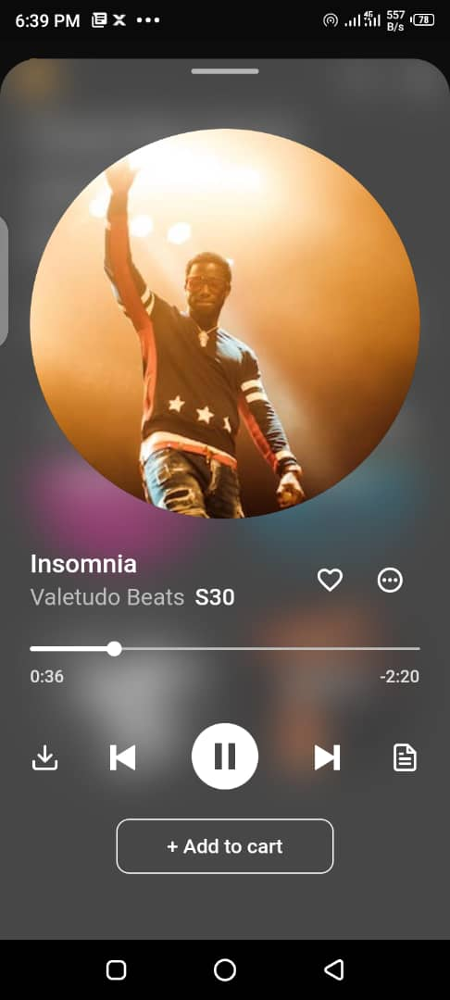
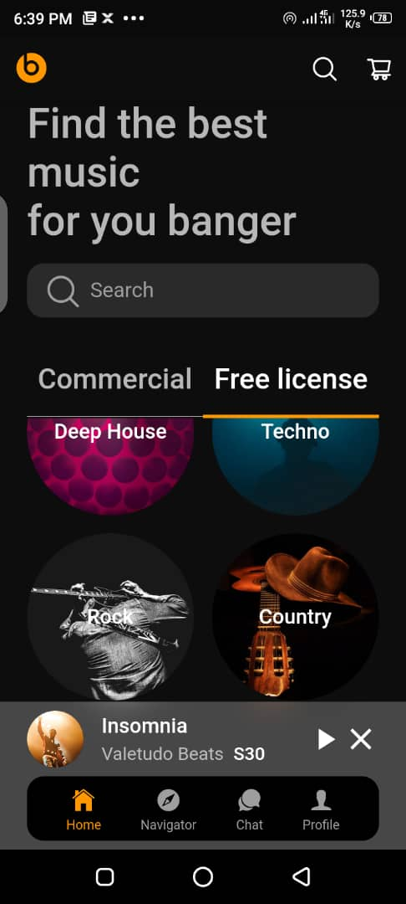
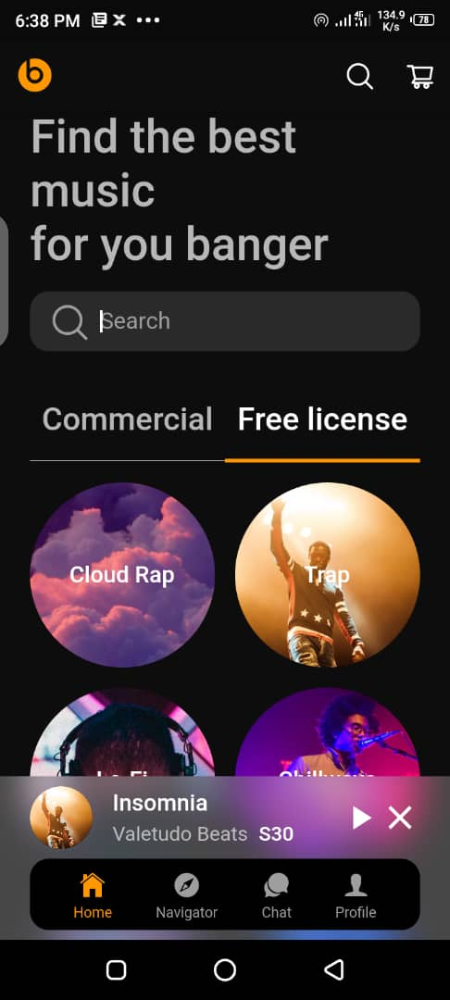

# music_app

## Project Overview
This is a simple music play app with a beautiful UI, this app was created to mimic spotify, its almost similar to spotify but not as vast as spotify. Flutter was the framework used to build the app

## Installation
To get the source code up and running on your computer, you need to first install an IDE, preferably [Android Studio](https://developer.android.com/studio?gclid=Cj0KCQiAmKiQBhClARIsAKtSj-mCE3Dc0T4FuVNp5WzCsOKbAIlaTP-7DuCYL-p5D8PZbAPgfU6IizEaAuYyEALw_wcB&gclsrc=aw.ds), follow instructions that pop up while installing Android studio.
After it has successfully installed, install the flutter plugin and download Dart SDK, instructions on how to do that can be found [here](https://flutter.dev/?gclid=Cj0KCQiAmKiQBhClARIsAKtSj-lDkI-zjlymTZot1n0GglKPrghu2aqO_4cwNH_bZUuLGbCyh_Dwun0aAqgDEALw_wcB&gclsrc=aw.ds). when that is done,
clone this repository by going to your git terminal and running the command below

*git clone https://github.com/VershimaKelvin/car_rental_app.git*

this should be the resulting display after the repository has been cloned successfully

    

open the project in your IDE and run flutter pug get in the terminal or from the tools menu

    

this should be the resulting screen after a successful pubrun

    

The Project is now ready to be tested on a real device or Emulator, to run app, locate run on the menu bar and select run'main.dart'

    

## Screenshots
 screenshots column1 | Screenshot column2 | Screenshot column3
 :--------: | :--------: | :--------:
 | | |

